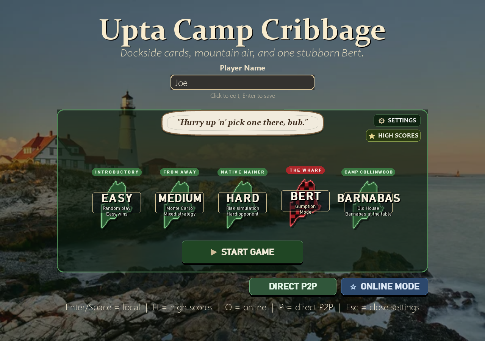
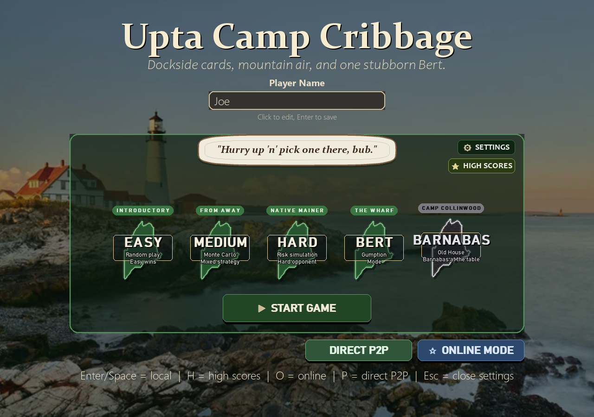
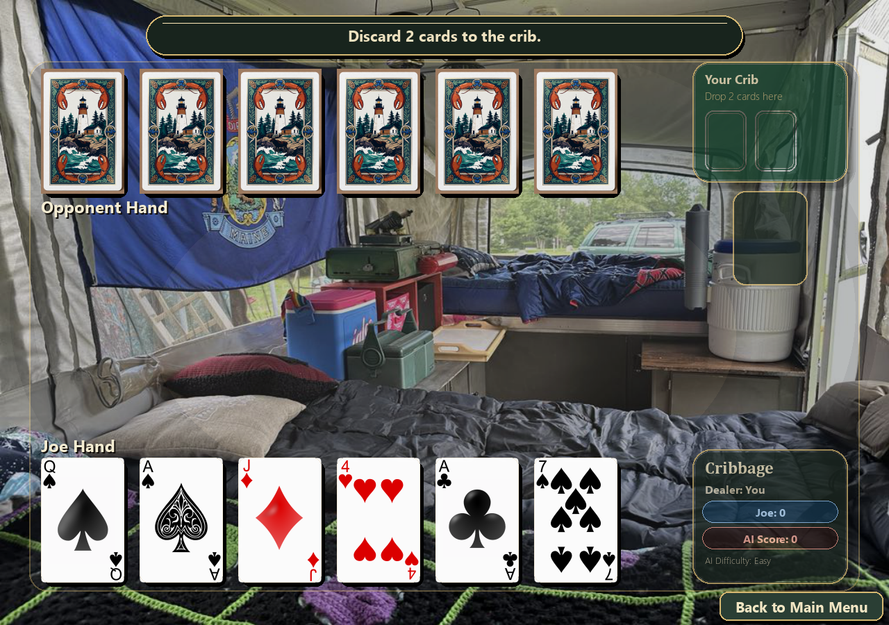
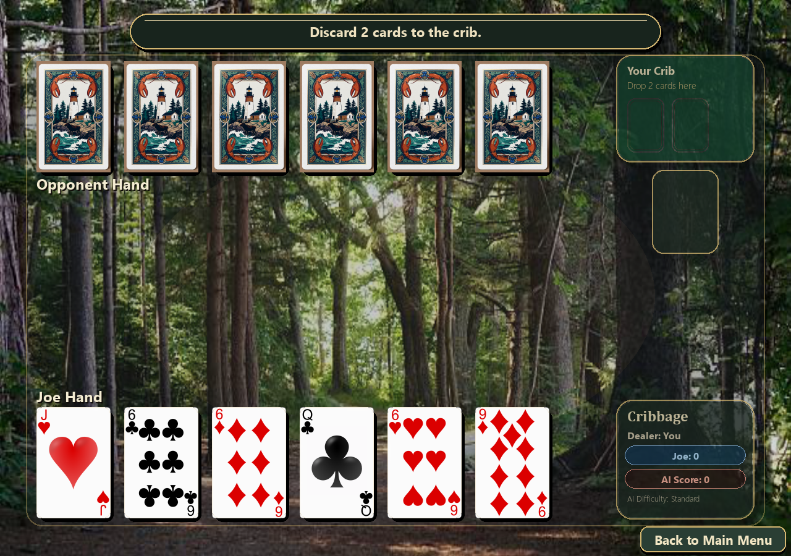
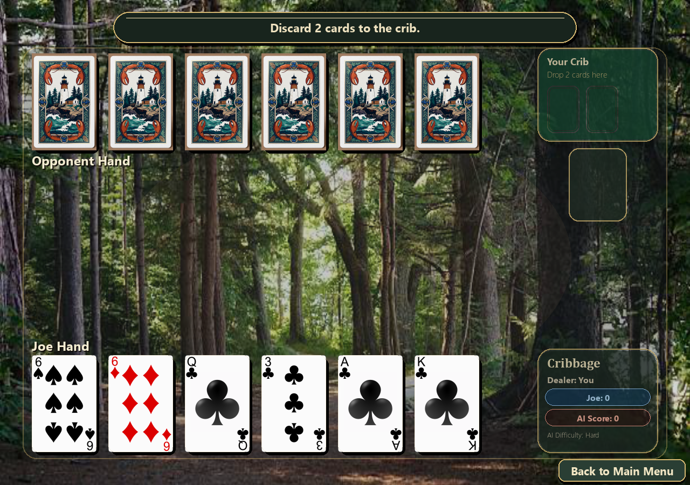
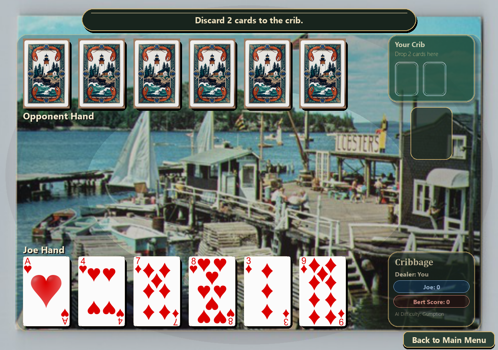
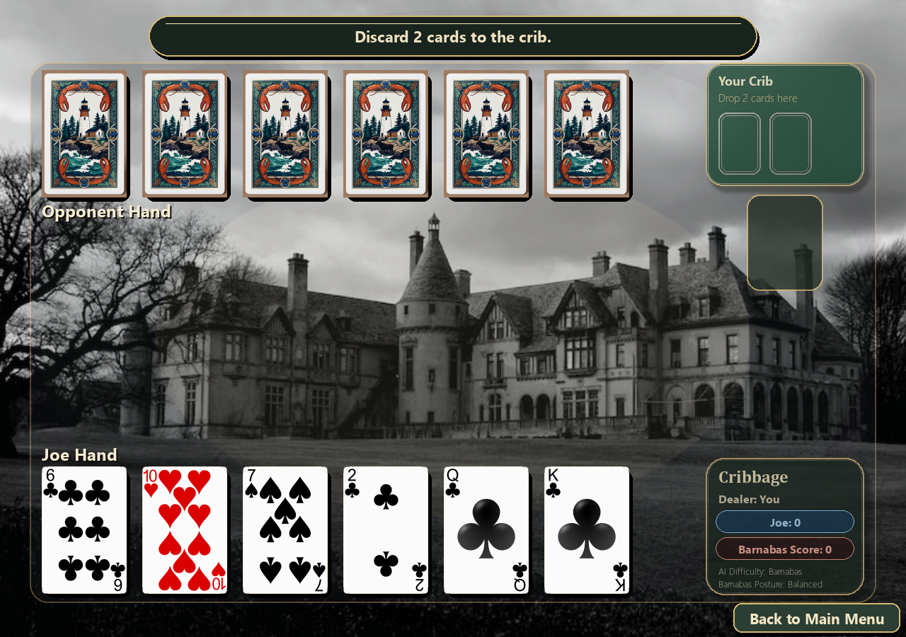
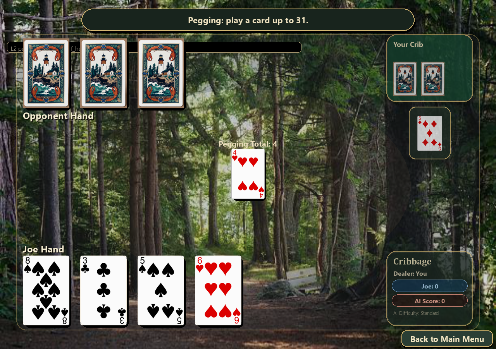
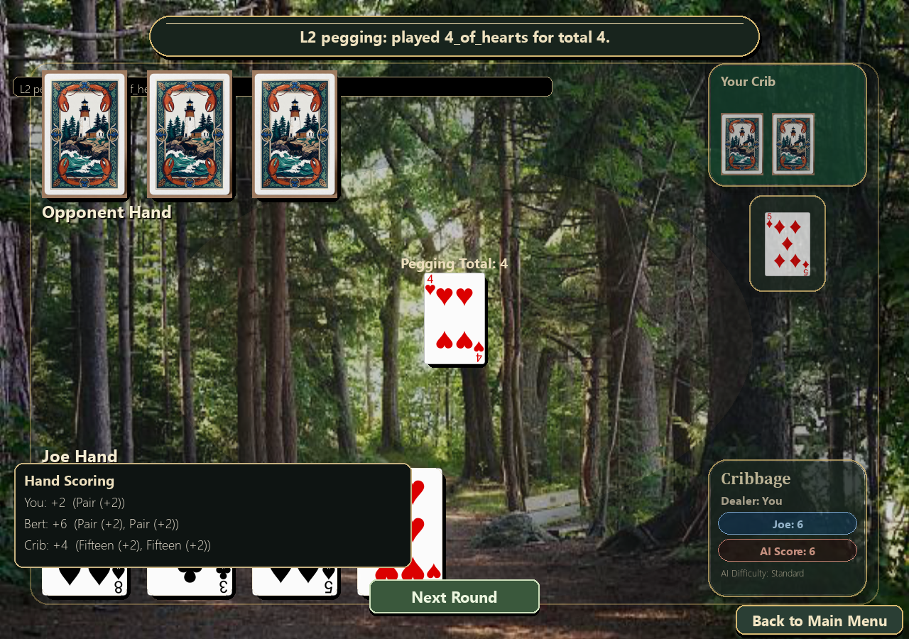

# UptaCamp - Camp Cribbage (Beta)

UptaCamp is a Python + Pygame cribbage game with local play, AI opponents, and online friend matchmaking through hosted API/WebSocket services.

## Beta Download (Windows)

[Download Windows Beta Release](https://github.com/josephgiardello-cloud/UptaCamp/releases/tag/v1.1.0-beta)

> [!WARNING]
> This is a beta build for testing. Expect bugs, balancing changes, and occasional online service interruptions.
> Save data and online compatibility may change between beta drops.

[](https://uptacamp-api.onrender.com/health)

> The API status badge checks backend health only.
> This repository does not currently host a browser-playable web client.

## Current Project State (May 2026)

- Desktop-first game client (Python/Pygame) is the primary way to play.
- Online mode is supported in-client via hosted API + WebSocket endpoints.
- Multiple AI levels are available, including Barnabas as the top tier.
- Automated tests are active under `tests/` and used as part of the quality gates.
- Windows beta build is distributed as a zip containing the packaged executable.

## Screenshots (Current Beta UI)

### New Beta Screenshot Series

All screenshots in this series live under `screenshots/beta_series_2026_05/`.

### Title Screen (Current Intro)


### Title Screen (Classic Framing)


### Gameplay - Easy Level (Discard)


### Gameplay - Medium Level (Discard)


### Gameplay - Hard Level (Discard)


### Gameplay - Bert Level (Discard)


### Gameplay - Barnabas Level (Discard)


### Gameplay - Pegging Phase


### Gameplay - Counting / End Of Hand


### Level Selection Coverage

The title screens above show the current selectable difficulty cards:

- Easy
- Medium
- Hard
- Bert
- Barnabas

## How To Play

### Option A: Windows beta zip (fastest)

1. Download the beta zip from the link at the top.
2. Right-click zip -> Extract All.
3. Open the extracted `CribbageGame` folder.
4. Run `CribbageGame.exe` from that extracted folder (do not run from inside the zip viewer).

### Option B: Run from source

Prerequisites:

- Python 3.10+
- pip

Setup:

```bash
python -m venv .venv
.venv\Scripts\activate
python -m pip install -U pip
pip install -e .[dev]
```

Start game:

```bash
python main.py
```

## Online Play

Online play happens inside the desktop game, not in the browser.

In-game flow:

1. Launch game.
2. Choose Play With Friend.
3. Enter display name.
4. Choose Host Friend Match, Join With Code, or Quick Match.

Default production endpoints are now used by the client unless overridden:

- API: https://uptacamp-api.onrender.com
- WebSocket: wss://uptacamp-ws.onrender.com

For local development servers:

```bash
python online_api_server.py --host 127.0.0.1 --port 8787 --db data/online_state.db
python online_ws_server.py --host 127.0.0.1 --port 8790 --db data/online_state.db
python main.py --online-url http://127.0.0.1:8787 --online-ws-url ws://127.0.0.1:8790
```

## Controls

- Enter or Space: start from intro
- Mouse click: select difficulty, discard cards, and play pegging cards
- O: open online flow
- P: open direct P2P lobby
- S: open settings
- R: next round or return to intro after game over
- Esc: back/pause depending on current state

## Build A New Windows Test Zip

From repository root:

```powershell
.\build_windows.ps1 -SkipPip
```

Output artifact:

- CribbageGame-Windows-Test.zip (repo root)

See deployment details in docs/DEPLOY_ONLINE.md and beta release notes in docs/RELEASE_v1.1.0-beta.md.

## Quality Gates

```bash
python -m ruff check .
python -m black --check .
python -m mypy --ignore-missing-imports .
python -m pytest -q .
```

## Contributing

See CONTRIBUTING.md and CODE_OF_CONDUCT.md.

## License

MIT. See LICENSE.
