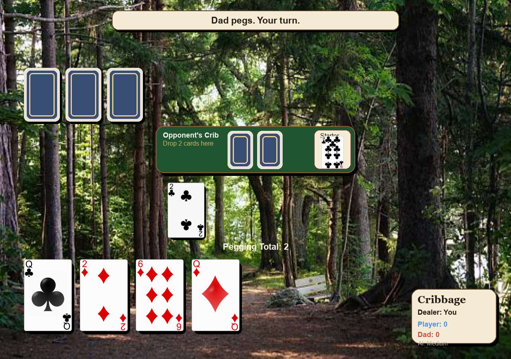

# UptaCamp - The Camp Cribbage Game 🃏

A fun, interactive **Cribbage card game** built with Python and Pygame. Play against an intelligent AI opponent with adjustable difficulty levels.

## Table of Contents

- [Overview](#overview)
- [Screenshots](#screenshots)
- [Features](#features)
- [Tech Stack](#tech-stack)
- [Installation](#installation)
- [How to Play](#how-to-play)
- [Difficulty Levels](#difficulty-levels)
- [Development](#development)
- [Contributing](#contributing)
- [License](#license)

## Overview

**UptaCamp** is a fully playable Cribbage implementation featuring:
- Accurate Cribbage game rules and scoring
- Intelligent AI opponent with 3 difficulty levels
- Beautiful card graphics and UI
- Automatic hand scoring and counting
- Support for multiple rounds with running scores

Cribbage is a classic two-player card game known for its unique scoring system and strategic depth. If you're new to Cribbage, start with the **Easy** difficulty to learn the rules!

## Screenshots

### Title Screen


### Gameplay Screen


## Features

✅ **Complete Cribbage Game**
- Deal, discard, pegging, and counting phases
- Accurate hand scoring (pairs, runs, fifteens, flush, nobs)
- Automatic crib scoring
- Winner detection at 121 points

✅ **Intelligent AI**
- Level 1 (Easy): Random play
- Level 2 (Medium): Monte Carlo evaluation across unseen cards
- Level 3 (Hard): Opponent risk estimation without hand peeking

✅ **User-Friendly Interface**
- Drag-and-drop card selection
- Clear game phase indicators
- Real-time scoring display
- Responsive window sizing

✅ **Flexible Gameplay**
- Choose AI difficulty before each game
- Track scores across multiple rounds
- Switch difficulty mid-session with F2

## Tech Stack

| Component | Technology |
|-----------|------------|
| **Language** | Python 3.10+ |
| **GUI Framework** | Pygame |
| **Game Logic** | Custom Cribbage engine |
| **Scoring** | cards.py module |
| **Assets** | PNG card graphics (SVG source) |

## Installation

### Prerequisites
- Python 3.10 or later
- pip (Python package manager)

### Steps

1. **Clone the repository**
   ```bash
   git clone https://github.com/josephgiardello-cloud/UptaCamp.git
   cd UptaCamp
   ```

2. **Create a virtual environment** (recommended)
   ```bash
   python -m venv .venv
   .venv\Scripts\activate          # On Windows
   source .venv/bin/activate      # On macOS/Linux
   ```

3. **Install dependencies**
   ```bash
   pip install pygame
   ```

4. **Run the game**
   ```bash
   python cribbage_pygame.py
   ```

## How to Play

### Starting a Game
1. Launch the game: `python cribbage_pygame.py`
2. Press **Enter** to start
3. Choose AI difficulty with **1** (Easy), **2** (Medium), or **3** (Hard)

### Game Phases

#### Discard Phase
- You're dealt 6 cards
- Select 2 cards to discard to the "crib"
- The AI automatically selects its discards
- One card is cut as the "starter"

#### Pegging Phase
- Take turns playing cards from your 4-card hand
- Keep a running total (max 31 points)
- Score points for:
  - **Pairs**: Same rank (2 points)
  - **Pairs Royal**: Three of a kind (6 points)
  - **Double Pair Royal**: Four of a kind (12 points)
  - **Fifteens**: Cards totaling 15 (2 points each)
  - **Thirty-One**: Exactly 31 (2 points)
  - **Runs**: Consecutive ranks (3+ cards)
- Play "Go" if you can't play without exceeding 31
- Last card played earns 1 point

#### Counting Phase
- Score your hand against the starter card
- The dealer scores the crib for bonus points

### Scoring Rules
- **Fifteens**: Each combination of cards totaling 15 = 2 points
- **Pairs**: Cards of same rank = 2 points (3+ pairs multiply)
- **Runs**: 3+ consecutive cards = points equal to run length
- **Flush**: 4+ cards of same suit = 4 points (5 cards = 5 points)
- **Nobs**: Jack of same suit as starter = 1 point

### Winning
First player to reach **121 points** wins!

## Difficulty Levels

### Level 1: Easy 🌱
- AI plays randomly
- Perfect for learning the rules
- ~40% win rate for new players

### Level 2: Medium 🌳
- AI evaluates all possible starting hands
- Uses Monte Carlo method for discard selection
- ~60% win rate for experienced players

### Level 3: Hard 🌲
- AI predicts opponent replies without peeking
- Simulates 140+ possible opponent hands per move
- Avoids risky plays at dangerous totals
- ~85% win rate for most players

**Pro Tip**: Switch difficulty with **F2** during gameplay!

## Development

### Project Structure
```
UptaCamp/
├── cribbage_pygame.py        # Main game
├── cards.py                  # Scoring engine
├── convert_card_assets.py    # Asset utilities
├── assets/
│   └── cards/                # Card PNG images (52 standard deck)
├── tests/                    # Unit tests (coming soon)
├── docs/                     # Detailed documentation
├── pyproject.toml            # Project configuration
├── README.md                 # This file
├── LICENSE                   # MIT License
└── .gitignore               # Git ignore rules
```

### Running Tests
```bash
pytest tests/
```

### Linting & Code Quality
```bash
ruff check .
black --check .
```

### Building Card Assets (Optional)
If you modify card SVG files:
```bash
python convert_card_assets.py
```

## Contributing

We welcome contributions! Please read [CONTRIBUTING.md](CONTRIBUTING.md) for our development process and guidelines.

### Quick Start
1. Fork the repository
2. Create a feature branch (`git checkout -b feature/your-feature`)
3. Make your changes
4. Run tests: `pytest tests/`
5. Commit with a clear message
6. Push to your fork
7. Open a Pull Request

### Bug Reports
Found a bug? Please open an [Issue](https://github.com/josephgiardello-cloud/UptaCamp/issues) with:
- Description of the problem
- Steps to reproduce
- Expected vs. actual behavior
- Screenshots (if applicable)

## License

This project is licensed under the **MIT License** - see [LICENSE](LICENSE) for details.

MIT License permits:
- ✅ Commercial use
- ✅ Modification
- ✅ Distribution
- ✅ Private use

But requires:
- ⚠️ License and copyright notice

## Credits

- **Game Logic**: Cribbage rules implementation
- **AI**: Monte Carlo and opponent simulation algorithms
- **UI**: Pygame framework
- **Card Assets**: Digital card graphics

---

**Questions?** Open an issue or check our [CODE_OF_CONDUCT.md](CODE_OF_CONDUCT.md) for community guidelines.

**Happy Playing! 🎮**
