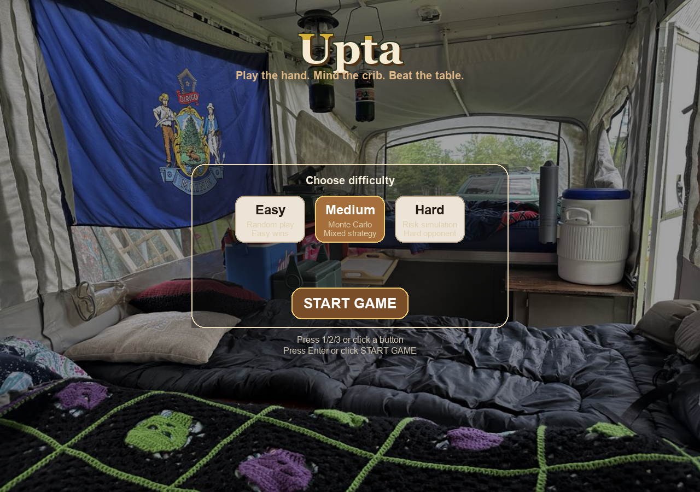
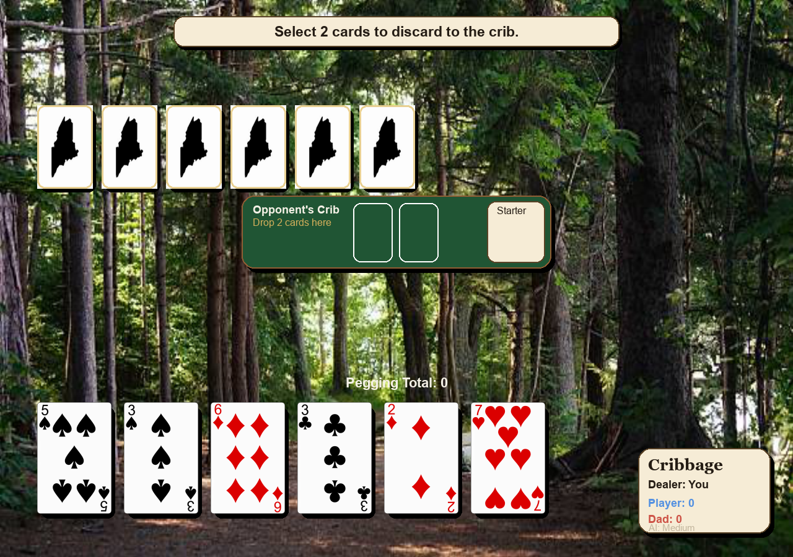
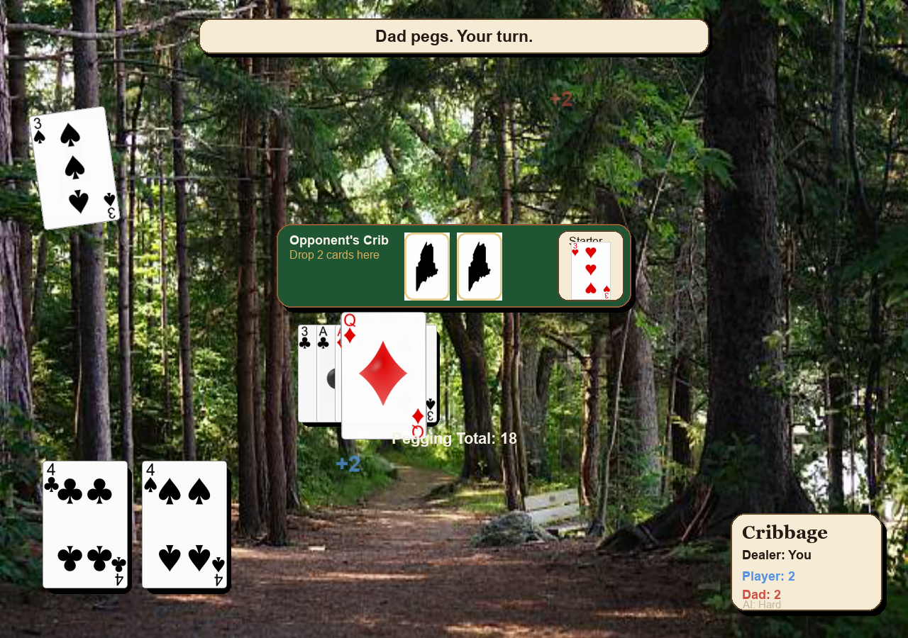
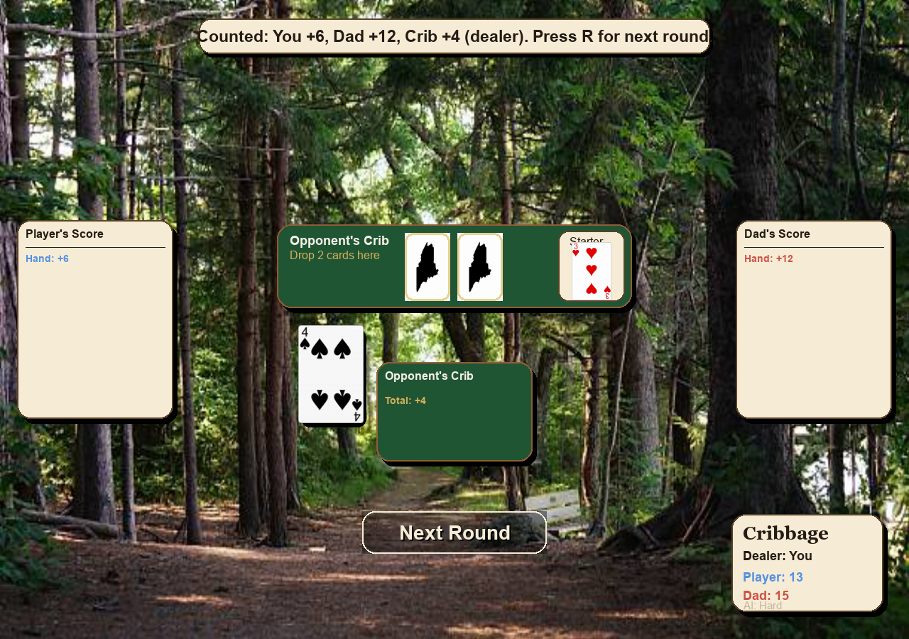

# UptaCamp - The Camp Cribbage Game

UptaCamp is a Python + Pygame cribbage game with a state-driven local client and an online backend/websocket stack.

## Highlights

- Full cribbage flow: deal, discard, pegging, counting, round reset, game over.
- Centralized scoring in `cards.py`:
  - hand scoring (`score_hand`)
  - pegging scoring (`score_pegging_play`)
  - run detection with multiplicity (`find_all_runs`)
- Six AI tiers in the intro flow:
  - 1 Easy
  - 2 Medium
  - 3 Hard
  - 4 Bert
  - 5 Old House (Barnabas)
  - 6 Barnabas (unlock/progression gated)
- State-driven visual client with animation/audio effects.
- Online API + websocket stack with auth tokens, turn validation, idempotency, matchmaking, profile/leaderboard data.
- Test and static-analysis gates integrated and actively used.

## Screenshots

### Title / Welcome


### Discard Phase


### Pegging Phase


### End-of-Hand Counting


## Installation

### Prerequisites

- Python 3.10+
- pip

### Setup

1. Clone and enter the repo.
2. Create and activate a virtual environment.
3. Install in editable mode with dev dependencies.

```bash
python -m venv .venv
.venv\Scripts\activate
python -m pip install -U pip
pip install -e .[dev]
```

## Running The Game

### Default launch (state-driven client)

```bash
python main.py
```

### Play online with a friend (easy mode)

1. Start the online services (API + websocket):

```bash
python online_api_server.py --host 127.0.0.1 --port 8787 --db online_state.db
python online_ws_server.py --host 127.0.0.1 --port 8790 --db online_state.db
```

2. Start the client:

```bash
python main.py --online-url http://127.0.0.1:8787 --online-ws-url ws://127.0.0.1:8790
```

3. In-game flow:
- Choose `Play With Friend`
- Enter your display name
- Pick one:
  - `Host Friend Match`: creates a share code for your friend
  - `Join With Code`: enter your friend's code and press Enter
  - `Quick Match`: auto-pair with available players

### Online client path (advanced)

```bash
python main.py --online-url http://127.0.0.1:8787 --online-ws-url ws://127.0.0.1:8790
```

## Controls

- `Enter`/`Space`: start from intro.
- Mouse click: choose difficulty on intro, select discard cards, and play pegging cards.
- Click player-name field on intro: edit profile name, `Enter` to save.
- `R`: next round (end screen) or back to intro (game over).
- `O`: jump to online mode from intro.
- `P`: jump to direct P2P lobby from intro.
- `S`: settings modal on intro.

## Rules Coverage

The implementation includes the standard cribbage scoring categories:

- Fifteens
- Pairs / triples / quadruples
- Runs including duplicated-rank multiplicity handling
- Flush (hand and crib rules)
- Nobs
- Pegging events (15, 31, pairs, runs, go, last card)

Target score is 121.

## Project Layout

```text
.
|- main.py
|- engine.py
|- game_state.py
|- phase_states.py
|- cards.py
|- ai_strategy.py
|- app_context.py
|- stats_manager.py
|- online_api_server.py
|- online_ws_server.py
|- online_backend.py
|- tests/
|- assets/
|- tools/
|- pyproject.toml
`- README.md
```

## Quality Gates

Run all static and test gates:

```bash
python -m ruff check .
python -m black --check .
python -m mypy --ignore-missing-imports .
python -m pytest -q .
```

## Test Coverage Focus

The test suite includes dedicated files for:

- scoring behavior (`tests/test_scoring.py`, `tests/test_scoring_vectors.py`, `tests/test_cards_pegging_scoring.py`)
- engine behavior (`tests/test_engine.py`, `tests/test_game_logic.py`)
- phase transitions (`tests/test_phase_transitions.py`)
- state model (`tests/test_game_state.py`, `tests/test_game_state_model.py`)
- entry points (`tests/test_main_entrypoint.py`)
- online backend/websocket flows (`tests/test_online_backend.py`, `tests/test_online_ws_server.py`, etc.)

## Online Backend

> **Status**: Online multiplayer support is implemented with API + websocket stack. The backend supports authentication, matchmaking, leaderboards, and turn-by-turn match progression. See tests in `tests/test_online_*.py` for full coverage.

### Start API server

```bash
python online_api_server.py --host 127.0.0.1 --port 8787 --db online_state.db
```

### Start websocket server

```bash
python online_ws_server.py --host 127.0.0.1 --port 8790 --db online_state.db
```

### Key endpoints

- `POST /players` (login/create session)
- `POST /invites/create`
- `POST /invites/accept`
- `POST /matchmaking/enqueue`
- `POST /matchmaking/pair`
- `POST /matches/{match_id}/turns`
- `POST /matches/{match_id}/finish`
- `GET /matches/{match_id}`
- `GET /leaderboard`

## Capture Helpers

Generate README screenshots/video from the game runtime:

```bash
python main.py --capture-title screenshots/readme_title.png --exit-after-capture
python main.py --capture-discard screenshots/readme_discard.png --exit-after-capture
python main.py --capture-gameplay screenshots/readme_pegging.png --exit-after-capture
python main.py --capture-video screenshots/gameplay_hand.mp4
```

If `ffmpeg` is unavailable, frame PNGs are still emitted to a sibling frames directory.

## Contributing

See `CONTRIBUTING.md` and `CODE_OF_CONDUCT.md`.

## License

MIT. See `LICENSE`.
